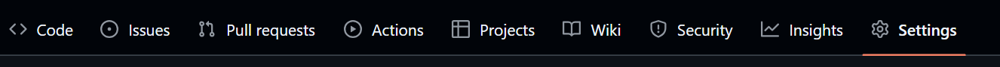
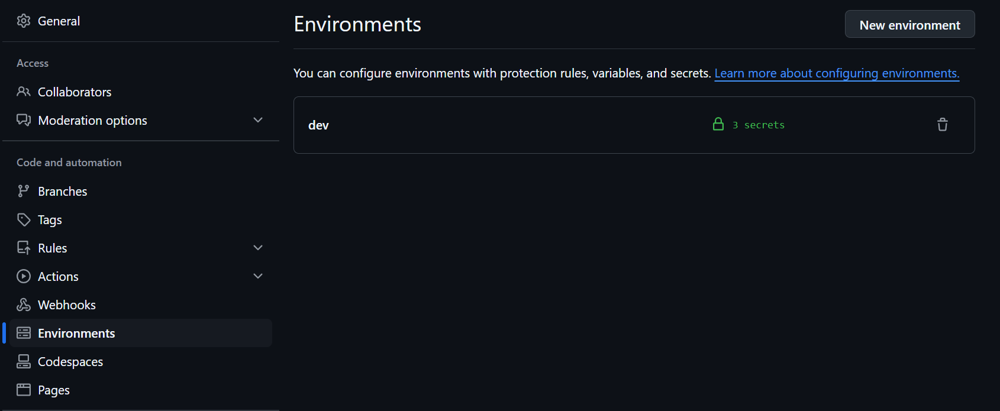
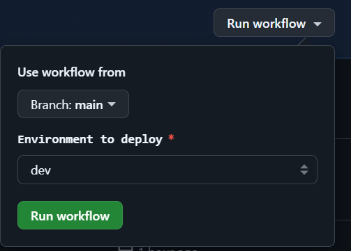

# Database Networking AWS config


Con este repositorio se podrá desplegar toda la infraestructura de base de datos y networking en una instancia de RDS configurable a partir de la modificación de algunos parámetros del archivo de configuración `project_properties.toml`

Todos los recursos generados son bajo el esquema "Bajo demanda"

## project_properties.toml

``` toml
[project.definition] # Sección de la definción general del proyecto
name = "my-awesome-project" # Nombre del proyecto. Será utilizado como prefijo de muchos recursos generados
description = "Awesome project to deploy a full RDS network infra using cloudformation" # Descripción del proyecto

[networking.config.vpc] # Sección de la configuración de la red privada
cidr = "10.61.0.0/16" # Rango de ips con notación CIDR para la VPC
mask_for_private = "/24" # Máscara de subred a aplicar a la VPC para generar las subnets privadas
mask_for_public = "/24" # Máscara de subred a aplicar a la VPC para generar las subnets públicas
names_for_private = 'A,B,C' # Cadena separada por comas para indicar las redes privadas a crear. Sólo se permiten los valores [A, B, C] sin repetir
names_for_public = 'A' # Cadena separada por comas para indicar las redes públicas a crear. Sólo se permiten los valores [A, B, C] sin repetir
enable_s3_gateway = 'true' # Indicador para habilitar un vpc endpoint para acceder a los buckets S3 de la cuenta

[rds.database] # Sección de la configuración de la instancia de base de datos
instance_class = "db.t3.micro" # Tipo de instancia de RDS a crear. Revisar valores permitidos aquí, varían costos: https://aws.amazon.com/es/rds/instance-types/
store_gib = "20" # Tamaño de la memoria en Gigabytes. Los máximos varían de acuerdo al tipo de instancia, revisar el link anterior
engine = "postgres" # Motor de base de datos a utilizar. Valores permitidos en este link: https://docs.aws.amazon.com/AWSCloudFormation/latest/UserGuide/aws-resource-rds-dbinstance.html#cfn-rds-dbinstance-engine
version = "16.4" # Versión del motor de base de datos. Puede revisar los valores permitidos de acuerdo  con el motor utilizando el siguiente comando de AWS CLI `aws rds describe-db-engine-versions --default-only --engine ${engine}`

[rds.database.config] # Sección de la configuración de la base de datos
db_name = "my_awesome_db" # Nombre de la base de datos
db_user_name = "awesomeAdminUser" # Usuario default de la base de datos
db_port = "5432" # Puerto de la base de datos

# NOTA IMPORTANTE: La contraseña de la base de datos es autogenerada en el secret manager y almacenada en el mismo con el siguiente nombre "${Ambiente}-${project.definition.name}-DBPassword"

[ec2.bastion] # Sección de configuración del bastion
create_bastion = 'true' # Indica si se debe crear el bastion o no
image_name = "/aws/service/ami-amazon-linux-latest/amzn2-ami-kernel-5.10-hvm-x86_64-gp2" # Imagen a utilizar - Se recomienda utilizar imágenes de Linux AWS para facilitar las conexiones de tunel a través del session-manager
instance_type = "t3.micro" # Tipo de instancia de la EC2 a crear
ssh_port = 5210 # Puerto SSH de la instancia

```

## Recursos generados extras

Para poder desplegar toda la infraestractura, hay elementos de AWS que se crean que no están explícitamente en el archivo de configuración. Estos son:

* Parametros de system manager
* Secretos de secret manager
* Funciones lambdas
* Grupos de registros de cloudwatch
* Roles de IAM
* Canalizaciones de code pipeline
* Almacenamiento de buckets S3
* Eventos de eventbridge
* Rastros de cloudtrail
* Macros de cloudformation

## Configuración para el despliegue con Github Actions

Este proyecto se puede realizar un fork y desplegar de acuerdo con las necesidades del negocio. Si lo que se desea es utilizar la herramienta de github actions, se tiene que realizar algunas configuraciones previas, para realizar un despliegue fácil, seguro y exitoso.

### Configurar proveedor de identidad de Github en AWS

Para poder realizar una configuración de despliegue segura de AWS utilizando github actions. Se debe realizar una integración del proveedor a través de OpenID Connect.

Este servicio permite que los flujos de github actions accedan a recursos de AWS sin la necesidad de almacenar credenciales de AWS en Github.

Para configurar los roles necesarios y el proveedor de identidad de github en AWS, seguir las instrucciones que vienen en el siguiente enlace: https://docs.github.com/en/actions/security-for-github-actions/security-hardening-your-deployments/configuring-openid-connect-in-amazon-web-services

### Creación de ambientes de Github

Una vez hecho el fork del proyecto. Se debe ir a la sección de configuración de Github



Luego ir a la sección de ambientes y crear uno nuevo. Se puede utilizar el nombre que se desee, pero se recomienda los siguientes:

* dev
* qa
* uat
* staging
* prod



Y una vez creado el nuevo ambiente, se deben crear 3 secretos con los siguientes nombre y valor:

* AWS_ACCOUNT_ID - Número de Cuenta de AWS
* AWS_REGION - Región de aws seleccionada para despliegue
* AWS_ROLE_TO_ASSUME - ARN del rol creado en el paso anterior. Si quedaron dudas revisar [este enlace](https://docs.aws.amazon.com/IAM/latest/UserGuide/id_roles_create_for-idp_oidc.html#idp_oidc_Create_GitHub)

Una vez configurado estos secretos, aparecerá la opción para ejecutar en la sección `Actions` del repositorio. Donde sólo hay que seleccionar la rama a desplegar y el ambiente creado previamente.

